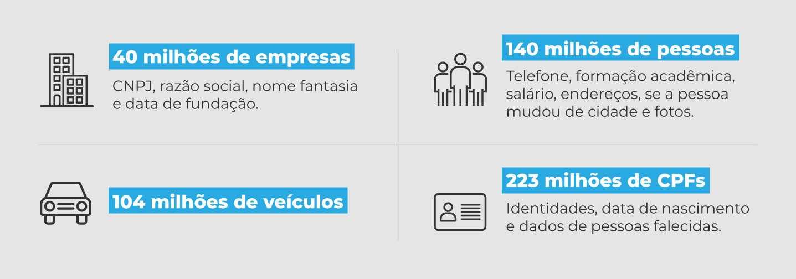

## Art. 46º: Medidas de Segurança - Atente-se aos padrões mínimos exigidos

O Artigo 46 da LGPD foca na implantação de medidas de segurança, tanto técnicas, quanto administrativas por parte dos controladores dos dados a serem protegidos. O artigo visa evitar acessos não autorizados, destruição, seja ela, acidental ou não, perda, alteração, e qualquer outra forma de modificação ou comunicação inadequada. 

O artigo deixa claro que a autoridade competente poderá ter padrões mínimos, como regras e normas de segurança, visando que as organizações cumpram o que está definido no mesmo, esses podem variar de acordo com a natureza e as características dos dados, além do estado atual que a tecnologia se encontra. Os padrões devem ser observados desde a concepção do produto ou serviço, até a sua execução.

### O que isso significa para você, desenvolvedor?

Que antes de sair por aí, trabalhando e tratando os dados alheios, da forma como você imagina que deve ser feito, é necessário verificar a Lei Geral de Proteção de Dados, entender qual a posição do seu caso dentro dela, conhecendo os dados que você irá tratar e o seu sistema. Após isso então, verificar os padrões, regras e normas exigidas para a sua situação e desenvolver ou "codar", como os desenvolvedores gostam de falar, de forma alinhada com a lei. 

### 📰 Caso Real:

Vazamento de dados de 223 milhões de brasileiros, informações como nome, CPF, endereço, número de telefone e até dados de renda se espalharam pela web,
A origem exata, não foi confirmada, porém, especialistas do ramo apontam para falhas de segurança em bancos de dados do governo e de grandes empresas.
Justamente o ponto tratado no Art. 46, uma falha na implementação de medidas técnicas e administrativas de segurança.
[Saiba mais](https://luchesiadv.com.br/quando-a-lgpd-e-ignorada-o-caso-do-vazamento-de-dados-de-223-milhoes-de-brasileiros/)



### Impacto no Dev e Como Diminuir o Risco:

#### 1. Verificar os Padrões Mínimos Exigidos

No momento em que você descobre que sua aplicação irá tratar dados sensíveis, corra para a documentação e inicie os estudo, antes mesmo de documentar o início do software.

**Boas Práticas:**

*   **Claro entendimento dos dados que você irá manipular:** Para entender onde o seu sistema se enquadra dentro das regras, que podem variar entre diferentes sistemas, é necessário ter profundo conhecimento dos dados que você irá manipular.
*   **Estudo de Documentação Prévio:** Verificar a LGPD para entender as necessidades e ser assertivo na documentação e desenvolvimento do software.
*   **Consultoria com pessoas especializadas:** Em muitos casos, o desenvolvedor pode não ter os conhecimentos necesários para interpretar a lei de forma correta, pode ser necessário a contratação de uma consultoria especializada.

#### 2. Use boas práticas de Engenharia de Software, e construa o seu sistema pensando a segurança desde o início

O Art. 46 pede que o sistema atenda os requisitos mínimos exigidos, e para que isso seja alcançado com facilidade, o desenvolvimento deve ser pautado com essa segurança em primeiro lugar.

**Boas Práticas:**

*   **Projeto de Software:** Um bom projeto de software, define bem os caminhos a serem seguidos durante todo o processo de desenvolvimento, e deve nesses casos sensíveis, pautar a segurança em primeiro lugar.
*   **Escrita de testes:** Escreva testes automatizados que irão a cada nova implementação, testar se o sistema continua atingindo os padrões necessários, isso evita que mudanças afetem a segurança dos dados.
*   **Técnicas de Anonimização:** Uma boa prática da engenharia, é criptografar os dados, quando possível, evitando vazamentos durante transações e conversas entre sistemas por exemplo.
*   **Monitoramento:** Monitore acessos e mudanças em dados sensíveis, use de ferramentas de logs e análise como Splunk, gerando alertas para possíveis atividades ilícitas.


**Exemplo de Código:**

O código abaixo representa o uso de técnicas de anonimização de dados em linguagem Python.

```python
def gerar_chave():
    """Gera uma chave de criptografia e a salva em um arquivo."""
    chave = Fernet.generate_key()
    with open("chave.key", "wb") as key_file:
        key_file.write(chave)
    return chave

def criptografar_dado(dado_sensivel, chave):
    """Criptografa um dado sensível."""
    f = Fernet(chave)
    dado_criptografado = f.encrypt(dado_sensivel.encode())
    return dado_criptografado

# Gera a chave
    key = gerar_chave()

# Dado sensível a ser protegido
    cpf_usuario = "123.456.789-00"

# Criptografa o dado antes de armazenar ou transmitir
    cpf_criptografado = criptografar_dado(cpf_usuario, key)
```

#### 3. Mantenha-se atualizado 

Conforme os sistemas crescem, eles geralmente passam a coletar e manipular um maior número, e uma maior variedade de tipos de dados, tenha atenção durante todo o ciclo de vida do sistema.

**Boas Práticas:**

*   **Classificação dos Dados:** Conforme o sistema vai se moldando, e os dados mudando, mantenha uma classificação para odados sensíveis e públicos por exemplo.
*   **Políticas de Acesso:** Com os dados bem classificados, defina políticas de acesso para cada tipo, sendo mais restritivas nos dados protegidos e citados pela LGPD.

### Conclusão do Art. 46

O Art. 46 mostra que a segurança é responsabilidade dos agentes de tratamento dos dados, e o desenvolvedor entra nessa classificação bem na linha de frente. É necessário que o mesmo tenha o conhecimento dos dados que estão sendo tratados, e que pense o sistema de forma correta, contruindo o mesmo certo desde o começo para atender os padrões exigidos pela autoridade competente. Os conhecimentos do programador aqui são essenciais para o atendimento da norma, e devem ser ouvidos pelas organizações, que são o agente de tratamento macro.

